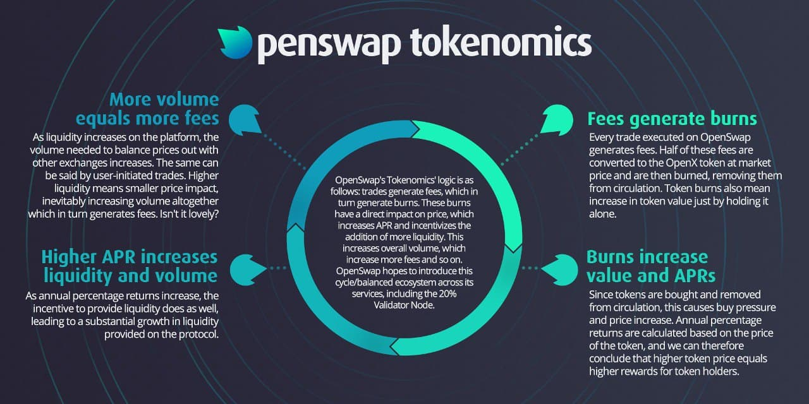

# OXST

**OXST HRC20 Token Address : 0x12F0e8B217F095B33be6b73b4B61e5487E46F5C9**

OxSwap’s native token, OXST, provides the foundation for the exchange. It is a means of payment to liquidity providers for the fees collected by trades.&#x20;

There was no presale or ICO for OXST. All tokens in circulation were fairly distributed to Liquidity Providers and single asset stakers. The OxSwap token underwent a migration from V1 to V2 in October of 2021. Please refer to the V2 migration documentation in the menu for additional information.

## Tokenomics&#x20;

The OxSwap token has both inflationary and deflationary mechanics, having farming for liquidity providers and a fee structure that splits the fee between rewarding liquidity providers and a token burn.  Half of the 0.3% fee applied to all trades is used to buy back and burn OxSwap Tokens from the ONE/OXST pool.

**Volume Increases Fees -> Fees Generate Burns -> Burns Increase Value and APRs -> Higher APRs Increase Liquidity and Volume ->Volume Increase Fees**

****

### Token Distribution

Roughly 13,500,000 tokens will be minted each year.  There is no max supply for OxSwap. Inflation is offset by a burn mechanism.

* 12,000,000 million tokens will minted for issuance as rewards for staking liquidity on OxSwap.
  * Monthly = 1,000,000 tokens
* 1,500,000 tokens will be minted for the dev wallet.  This goes toward operations, maintenance, and marketing.
  * Monthly = 125,000 tokens

### Dev Wallet

The dev team is committed to working on OxSwap for the foreseeable future.  These funds will serve as payment for the work the Dev has and will accomplish  as well as cover operations and marketing cost.

The dev team receives a maximum of 12.5% of the minted tokens. **This means that OxSwap users get 87.5% of the total supply.**   Having a lower percentage of overall tokens for the dev wallet over a long period of time enforces trust between the developer and community.

A smart contract handles the release of these tokens.  28,846 OXST tokens are released on a weekly basis upon a function call to the lock contract. This function is only callable once a week.  The smart contract for the dev wallet allows for modification to lower this percentage in the future but there are safe guards in the smart contract to prevent it from going above 12.5%.  This allows the dev team to lower their payments in the future if it is deemed necessary.

### **Initial Token Distribution**

During the initial month of OxSwap, there was a greater minting rate to reward early liquidity providers.  This took place between mid May 2021 and mid June 2021. A total of 13,000,000 Tokens were minted and distributed to the early liquidity providers. 13,000,000 million tokens corresponds to 1 year and 1 month worth of tokens. This enabled liquidity providers who bootstrapped our initial liquidity to earn a significant amount of tokens during this time, around 13X normal issuance. &#x20;

This was and will be the only time the token distribution rate changes from the normal rate.\
